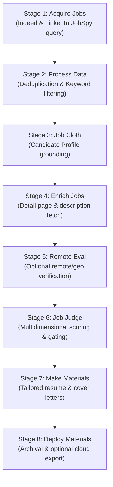

# AstroOM

[](LICENSE.md)
[](https://www.rust-lang.org/tools/install)
[](#supported-platforms)
[](#supported_platforms)<br>
[](https://antigravity.google/)
[](https://openai.com/codex/)
[](https://opencode.ai/)
[](https://openrouter.ai)

> **AstroOM** is an autonomous, multi-phase job acquisition and tailored application materials generation engine, written in Rust for Linux & Windows. It combines lightweight, headless job search querying with multi-provider LLM grounding to systematically evaluate opportunities, match candidate qualifications, and produce tailored application packages.

<p align = "center"></p>

Terminal captures are in [`screenshots/`](screenshots). Demo video is [here](https://github.com/user-attachments/assets/47c75496-f583-4e5e-8d2d-7b1136826c61). Sample output is in [`sample_materials/`](sample_materials).

---

> [!NOTE]
> **[AstroEX](https://github.com/sudoTni/AstroEX/) ↔ [AstroOM](https://github.com/sudoTni/AstroOM):** Both projects are fully functional, feature-equivalent, and ready for your job search. Going forward, **[AstroOM](https://github.com/sudoTni/AstroOM)** is the recommended version and may receive future updates.

---

## Legal & Compliance Disclaimer

> [!WARNING]
> ### Legal Disclaimer & Terms of Service Notice
> AstroOM is provided strictly for educational, research, and personal productivity purposes.
>
> Scraping job board platforms (including LinkedIn, Indeed, and others) may be subject to the respective platforms' Terms of Service, User Agreements, robots.txt directives, and applicable local laws. The developers and contributors of AstroOM:
> 1. Do not encourage, endorse, or promote unauthorized automated scraping, rate-limit evasion, or commercial extraction of proprietary data.
> 2. Assume no liability for account restrictions, IP blocks, CAPTCHA challenges, legal claims, or service suspensions resulting from the use of this software.
> 3. Urge all users to employ reasonable request throttling, respect robots.txt guidelines, and utilize official developer APIs whenever available for commercial or high-volume workflows.
>
> You are solely responsible for ensuring that your execution of AstroOM complies with all relevant terms of service, platform guidelines, and legal requirements.

---

## Privacy & Data Handling

- **AstroOM has no telemetry.** Nothing is phoned home except the requests you explicitly make to the job boards and to your configured LLM provider.
- **Your personal data lives in one place:** the candidate profile directory, `candidate_data/` by default. The application only reads it; it never writes to it and never bundles it into a release.
- **The profile directory is git-ignored.** Keep your résumé and testimonials out of version control and out of bug reports.
- Profile text is sent to whichever LLM provider your preset names (the shipped presets target OpenRouter). Treat it the same way you would any data you submit to a third-party API.
- A public Indeed mobile client key is compiled into the binary; it is not a user secret. See "Credentials" below.

---

## Core Pipeline Architecture

AstroOM organizes job application automation into 8 decoupled, cache-backed pipeline stages:



1. **Acquire Jobs**: Headless querying of LinkedIn and Indeed using resilient HTTP session retry policies, rotating proxy pools, and provider-specific header sets.
2. **Process Data**: Normalizes listings, removes blocklisted companies and titles, and filters out previously seen opportunities via SQLite.
3. **Job Cloth**: Reconciles raw job requirements against the candidate's skills and background.
4. **Enrich Jobs**: Fetches complete long-form job descriptions and employer profiles.
5. **Remote Eval**: Evaluates residency requirements, time zones, and remote eligibility rules.
6. **Job Judge**: Evaluates opportunities against candidate-defined gates (seniority, compensation, tech stack match) to generate a fit score (0–100).
7. **Make Materials**: Generates tailored resumes and cover letters for qualified opportunities.
8. **Deploy Materials**: Packages materials into formatted markdown files, JSON deployment payloads, and optional cloud storage sync via Google Apps Script.

Each stage writes a JSON artifact plus a companion `<artifact>.json.manifest.json` sidecar containing a SHA-256 digest, so a resumed or third-party artifact can always be verified with `astroom artifact verify <file>`.

---

## LLM Provider Support & Model Caveats

> [!NOTE]
> AstroOM speaks the OpenAI chat-completions protocol, so it can target OpenRouter as well as any OpenAI-compatible endpoint (local Ollama, vLLM, LM Studio, Groq, …).
>
> - **The shipped presets all target OpenRouter** (`config/presets.json`). To use another endpoint, either override the base URL for every stage with `--llm-base-url <url>`, or add a preset with your own `provider` and `base_url`.
> - **Prompt Adherence & JSON Formatting:** High-parameter reasoning models (e.g. Claude 3.5 Sonnet, GPT-4o) reliably produce valid schema-compliant JSON during the `jobCloth` and `jobJudge` phases. Smaller local models (7B or 8B parameters) may occasionally omit required delimiters or hallucinate keys.
> - **Context Windows:** Ensure your local LLM server context window is configured for at least 16,000 tokens to handle full resume inventories and lengthy job postings without silent truncation.
> - **Prompt presets:** Every stage selects a preset by name from `config/presets.json`. Each preset names its own `promptTemplate`; the tree ships both compact `*-mini.txt` prompts (referenced by the shipped presets) and longer full-size variants you can switch to by editing a preset.
> - **Prompts are yours to tune.** `prompts/` and `sysprompts/` are plain text with `{placeholder}` tokens. They encode one candidate's screening philosophy, including a hard-coded work-jurisdiction and commute area — edit them to match your own search before relying on the scores.

---

## Quick Start Guide

> [!NOTE]
> The AOM contributors highly recommend the use of a codex / AI coding assistant for rapidly configuring the software with your application materials!

### 1. Prerequisites

**Option A — use a prebuilt binary.** No toolchain needed.

A release binary needs the `config/`, `prompts/`, and `sysprompts/` directories **next to it**. AstroOM locates them relative to its own executable path, not to your working directory and not to wherever it was built, so you can copy the whole directory anywhere:

```
astro/
├── astroom            # or astroom.exe
├── config/presets.json
├── prompts/
├── sysprompts/
└── astro_launcher.bash # or astro_launcher.ps1
```

```bash
# Linux
./target/release/astroom --help
```

```powershell
# Windows (PowerShell)
.\target\x86_64-pc-windows-gnu\release\astroom.exe --help
```

The `data/`, `logs/` and `materials/` directories are created on first run beside the executable. If they are not writable there, pass `--data-dir` / `--log-dir` / `--materials-dir`, or set `ASTROOM_HOME`.

> **Linux runtime prerequisite:** the binary links against OpenSSL 3 (`libssl.so.3`, `libcrypto.so.3`) because `reqwest` uses the platform TLS stack. It is dynamically linked; check with `ldd target/release/astroom` before deploying to a minimal image.
>
> **Windows runtime prerequisite:** the GNU build needs only the Universal C Runtime, which ships with Windows 10 and later. It does not need OpenSSL (Windows uses Schannel) and does not need `libwinpthread-1.dll`.

**Option B — build from source.** Requires the [Rust toolchain](https://www.rust-lang.org/tools/install) (stable; CI uses `dtolnay/rust-toolchain@stable`).

| | Linux | Windows (`x86_64-pc-windows-gnu`) |
| :--- | :--- | :--- |
| Rust target | `x86_64-unknown-linux-gnu` (default) | `rustup target add x86_64-pc-windows-gnu` |
| C compiler | GCC or Clang, plus `pkg-config` and `libssl-dev` | MinGW-w64 (`gcc`, `g++`) — already on `PATH` in CI |
| Why a C compiler | bundled SQLite (`rusqlite` `bundled`) and OpenSSL | bundled SQLite |
| Linker | default | `x86_64-w64-mingw32-gcc`, which rustc selects automatically for this target; override with `CARGO_TARGET_X86_64_PC_WINDOWS_GNU_LINKER` if needed |

```bash
# Clone the repository
git clone https://github.com/sudoTni/AstroOM.git
cd AstroOM

# Linux
cargo build --release        # -> target/release/astroom
```

```powershell
# Windows (PowerShell)
rustup target add x86_64-pc-windows-gnu
cargo build --release --target x86_64-pc-windows-gnu
#   -> target†_64-pc-windows-gnu
eleasestroom.exe
```

Cross-compiling from Linux to `x86_64-pc-windows-gnu` works with the same command as long as MinGW-w64 is installed (`x86_64-w64-mingw32-gcc`). No `.cargo/config.toml` is required: rustc's target specification already selects the MinGW linker for this target.

### 2. Candidate Profile Setup

AstroOM keeps all personal job-search data outside the code, in a candidate profile directory. It defaults to `candidate_data/` and is selected with `--profile-dir`. The repository ships an annotated template — copy it and replace every file:

```bash
# Linux / macOS
cp -r candidate_data.example candidate_data

# Windows (PowerShell)
Copy-Item -Recurse candidate_data.example candidate_data
```

See [`candidate_data.example/README.md`](candidate_data.example/README.md) for the copy step and a per-field description. You can point `--profile-dir` at any other location if you would rather keep it elsewhere:

```bash
# Linux
./bin/astroom preflight --profile-dir ~/job-search-profile --json

# Windows (PowerShell)
.\bin\astroom.exe preflight --profile-dir $HOME\job-search-profile --json
```

`preflight` fails until the two required files exist and are non-empty, so it is the fastest way to confirm the profile is wired up before spending any tokens. The directory must contain these files:

| File | Required | What goes in it |
| :--- | :--- | :--- |
| `my_resume.txt` | **yes** | Your full plain-text résumé. Every factual claim in the generated materials must be defensible from this file. |
| `search_terms.txt` | **yes** | Target job titles, one per line. `#` comments and blank lines are ignored. |
| `my_professional_title.txt` | no | Your current professional title; `makeMaterials` tailors it per role. |
| `my_professional_summary.txt` | no | Your professional summary; tailored per role. |
| `my_key_skills.txt` | no | Comma-separated list of core competencies. |
| `my_testimonials.txt` | no | Quotes about you. Used only as qualitative evidence — never to establish a technology, a number of years, a certification, education, or clearance. |
| `company_filters.txt` | no | Company/agency names to exclude (case-insensitive substring match). |
| `title_filters.txt` | no | Title keywords to exclude (case-insensitive substring match). |

> Everything in `candidate_data.example/` is placeholder text. Replace all of it, or the generated application materials will describe the placeholder rather than you.

### 3. Credentials

AstroOM reads **no configuration from the environment.** Every setting reaches it through an explicit CLI flag, passed with either:

- `--api-key "<YOUR_KEY>"`, or
- `--api-key-file /path/to/key` (mutually exclusive with `--api-key`).

The only two variables AstroOM consults itself are the optional `ASTROOM_HOME` and `ASTROOM_RESOURCE_DIR` path overrides described under *Where AstroOM looks for things*, plus `TERM` / `NO_COLOR` / `CI` for terminal-capability detection. None of them can change what the application does beyond where it reads and writes.

For convenience the wrapper scripts (`astro_launcher.bash` / `astro_launcher.ps1`) read `AOM_OR_API_KEY` from a local `.env` and forward it:

```bash
# Linux
cp .env.example .env
$EDITOR .env          # set AOM_OR_API_KEY
```

```powershell
# Windows (PowerShell)
Copy-Item .env.example .env
notepad .env          # set AOM_OR_API_KEY
```

`.env` is git-ignored. Never commit a real key; rotate any key that is ever committed or shared.

The Indeed scraper uses a public Indeed mobile client key that is compiled into the binary. It is not a user secret, and it is deliberately not read from `.env` or the environment: a relocated binary therefore scrapes exactly like an in-tree one. Supply your own with `--indeed-api-key` if you have an Indeed API credential.

### 4. Running the Pipeline

Run the full 8-phase pipeline with the wrapper script:

```bash
# Linux
./astro_launcher.bash
```

```powershell
# Windows (PowerShell)
# If script execution is restricted on your system, enable it for the current process:
# Set-ExecutionPolicy -Scope Process -ExecutionPolicy Bypass
.\astro_launcher.ps1
```

Both launchers find the executable in this order, so a relocated install works without editing anything:

1. `$ASTROOM_BIN` (`$env:ASTROOM_BIN` on Windows)
2. `bin/astroom` / `bin/astroom.exe`
3. `astroom` / `astroom.exe` next to the launcher
4. `../bin/astroom`
5. `target/release/astroom` (and `target/x86_64-pc-windows-gnu/release/astroom.exe`)
6. `astroom` on `PATH`

If none exists the launcher prints every location it searched and exits 1 — *before* it deletes the previous run's logs.

The wrapper applies a tuned policy argv (presets, provider routing, `--remote-only`, cost tracking, internet watchdog) and appends any arguments you pass it **last**, so they override those defaults:

```bash
# Linux
./astro_launcher.bash --batch 50 --results-wanted 500 --clean
```

```powershell
# Windows (PowerShell)
.\astro_launcher.ps1 --batch 50 --results-wanted 500 --clean
```

Or invoke the binary directly:

```bash
# Linux
./bin/astroom run-pipeline \
  --job-provider indeed,linkedin \
  --profile-dir ./candidate_data \
  --api-key "<YOUR_KEY>" \
  --jobcloth-preset jc_glm-5.3-flash \
  --remoteeval-preset re_glm-5.3-flash \
  --jobjudge-preset jep_glm-5.3-flash \
  --makematerials-preset rop_glm-5.3-flash \
  --batch 25 --sleep 2 --results-wanted 200 --remote-only true
```

```powershell
# Windows (PowerShell)
.\bin\astroom.exe run-pipeline `
  --job-provider indeed,linkedin `
  --profile-dir .\candidate_data `
  --api-key "<YOUR_KEY>" `
  --jobcloth-preset jc_glm-5.3-flash `
  --remoteeval-preset re_glm-5.3-flash `
  --jobjudge-preset jep_glm-5.3-flash `
  --makematerials-preset rop_glm-5.3-flash `
  --batch 25 --sleep 2 --results-wanted 200 --remote-only true
```

Validate the setup before spending any tokens:

```bash
# Linux
./bin/astroom preflight --profile-dir ./candidate_data --json
```

```powershell
# Windows (PowerShell)
.\bin\astroom.exe preflight --profile-dir .\candidate_data --json
```

---

## CLI Command Reference

All subcommands support `--help` for comprehensive option listings.

| Command | Description |
| :--- | :--- |
| `run-pipeline` | Execute the complete end-to-end 8-phase acquisition and materials generation pipeline |
| `acquire-jobs` | Query job board platforms (Indeed, LinkedIn) and write raw acquired listings |
| `processData` | Filter acquired listings by company, title, and database deduplication |
| `jobCloth` | Ground job descriptions against candidate profile data |
| `enrich-jobs` | Fetch detailed long-form descriptions and company metadata |
| `jobJudge` | Score and filter jobs based on candidate gates and alignment rules |
| `makeMaterials` | Generate optimized, tailored resumes and cover letters for qualified opportunities |
| `preflight` | Validate system prerequisites, runtime paths, API keys, and model presets |
| `jobDb` | Inspect the local SQLite deduplication repository (`status`, `verify`, `backup`, `rotate-backups`) |
| `artifact` | Verify an artifact against its companion SHA-256 manifest (`artifact verify <file>`) |

**Stage 5 (Remote Eval) has no standalone subcommand.** It runs inside `run-pipeline` when `--remote-only` is enabled, which is the only supported way to use it.

### Global Flags
- `--verbose`, `-v`: Enable verbose debug logging output.
- `--no-color`, `--no-colors`: Disable ANSI terminal coloring and gradient banners.
- `--json`: Output machine-readable JSON records (implies banner suppression, `--log-level error`, and JSON log format).
- `--log-level <level>`: Set minimum log level (`trace`, `debug`, `info`, `success`, `warn`, `error`, `fatal`).
- `--log-format <fmt>`: `pretty` (default) or `json`.
- `--data-dir`, `--log-dir`, `--materials-dir`, `--profile-dir`: Override the default directories.
- `--llm-base-url <url>`: Override the OpenAI-compatible endpoint for every stage.
- `--indeed-api-key <key>`: Supply your own Indeed API credential.
- `-hr`, `--hide-reasoning`, `--no-show-reasoning`: Suppress reasoning output and force non-streaming requests.
- `-sr`, `--show-reasoning`, `--show-reasoning-tokens`: Print reasoning tokens and stream responses live.
- `--api-key`, `--api-key-file`: LLM credential (mutually exclusive).
- `--max-llm-requests`, `--max-llm-output-tokens`, `--max-total-llm-output-tokens`, `--llm-deadline-ms`: LLM spend and time budgets.
- `--log-llm-payloads`, `--log-max-payload-length`: Write every outbound LLM request body to `logs/*_payload_logs/`.

---

## Google Apps Script Deployment

Stage 8 can export materials with `rclone` (`--deploy --deploy-destination <remote>`), which is what the built-in pipeline uses.

[`deployMaterials.gs`](deployMaterials.gs) is an **optional, richer alternative** that runs entirely inside Google Workspace: it reads generated markdown from Drive, uses an LLM to discover company contact addresses, renders tailored Google Docs and PDFs, and creates or sends Gmail drafts.

To use it:
1. Open [Google Apps Script](https://script.google.com/) and create a new project.
2. Copy the contents of [`deployMaterials.gs`](deployMaterials.gs) into your script editor.
3. In **Project Settings → Script Properties**, define every key listed in the file's `SCRIPT_PROPERTIES` block — including the source, target, processed, and template folder IDs, your `APPLICANT_NAME` and `APPLICANT_EMAIL`, the log spreadsheet and folder, and your `OR_API_KEY`. No credential is hard-coded in the file.
4. Run `deployMaterials()` directly, or deploy as an API executable.

---

## Supported Platforms

| Target | Status |
| :--- | :--- |
| `x86_64-unknown-linux-gnu` | **Primary target.** Full native support, with the persistent animated banner. |
| `x86_64-pc-windows-gnu` | **Windows native.** Full support via `astro_launcher.ps1` or direct CLI execution. |
| Other POSIX (macOS, other Linux architectures) | Build from source with `cargo build --release`. |

AstroOM dual-targets Linux and Windows. Every OS-specific API lives in one auditable place, `src/platform/`:

| Concern | Linux | Windows |
| :--- | :--- | :--- |
| Execution log (`src/logging/execution_log.rs`) | File-descriptor tee through POSIX pipes: captures *everything*, including foreign code and child processes. | API-level tee: AstroOM's own output is mirrored to the log file while the standard handles stay untouched, so the console cannot be corrupted. |
| Artifact and log permissions | Mode `0600` / `0700`. | Inherited from the parent directory's ACL, which is user-private. |
| Signals | SIGINT and SIGTERM, mapped to exit codes 130 and 143. | Ctrl+C (`CTRL_C_EVENT`), mapped to 130. Windows does not deliver SIGTERM to console processes. |
| Terminal geometry | `TIOCGWINSZ`. | `GetConsoleScreenBufferInfo`. |
| ANSI colour | Native. | `ENABLE_VIRTUAL_TERMINAL_PROCESSING` is enabled at startup; if that fails, AstroOM falls back to uncoloured output rather than printing escape sequences literally. |
| Banner | Persistent animated footer in a scrolling region, preserving full terminal scrollback. | Bounded in-place animation. See below. |
| Process metrics | `/proc/self/status` and `/proc/self/stat`. | Not available; reported as `0`, as on any non-Linux host. |

### Banner behaviour

On a Unix terminal of at least 30 rows and 64 columns, AstroOM reserves the bottom nine rows for a continuously animated banner and confines application output to the rows above with a DECSTBM scrolling region. Because the region scrolls rather than switching buffers, **the full application output stays in the terminal's native scrollback** and the user can scroll back to the first line. A full-screen or alternate-screen TUI would *not* provide this: the alternate buffer has no history.

The footer is skipped — and the previous bounded in-place animation is used instead — when the terminal is smaller, when `TERM` is unset or `dumb`, when `NO_COLOR` or `CI` is set, when `--no-color`, `--json` or `--no-banner` is given, and **on all of Windows**, where legacy conhost either ignores scrolling regions or leaves one set after exit. In every skipped case the output is plain text with no cursor-control sequences, so redirecting to a file or piping into another program stays clean.

Because the footer is continuous, `--banner-loops` no longer bounds it; the flag still bounds the fallback animation.

---

## Development

```bash
cargo fmt --check
cargo clippy --all-targets --all-features -- -D warnings
cargo test
```

The test suite is fully offline. LLM-dependent paths run against a local mock OpenAI-compatible server (`tests/common/mod.rs`), and the Node-parity differential tests replay committed oracles from `tests/fixtures/`. The Node oracle generators in `tests/differential/` and the Node-vs-Rust CLI differ (`run_cli_differential.sh`) require a separate Node checkout of the predecessor project and are intentionally not part of `cargo test`.

CI runs the same commands on Linux, plus `clippy`, `test` and a release build for `x86_64-pc-windows-gnu` on a Windows runner. Four integration suites are `#![cfg(unix)]` because they need POSIX facilities the Windows build does not have: `launcher` (bash), `deploy` (a shell `rclone` shim and POSIX signals), `watchdog` (a shell `ping` shim) and `signals` (`kill(2)`). Everything else, including the path-resolution and Indeed-credential suites, runs on both targets.

### Where AstroOM looks for things

Relative paths you type on the command line always resolve against your current working directory. Everything else is resolved from the executable outward:

| What | Resolution order |
| :--- | :--- |
| `data/`, `logs/`, `materials/`, profile | explicit flag → `$ASTROOM_HOME` → resource root → executable directory → current directory |
| `config/`, `prompts/`, `sysprompts/` | `$ASTROOM_RESOURCE_DIR` → executable directory → nearest ancestor that contains `config/presets.json` |

The ancestor search is what keeps in-tree development working: `target/release/astroom` walks up to the repository root. **No build-machine path is compiled into the binary.** When a resource directory genuinely cannot be found, AstroOM says so and lists every location it searched, rather than falling back to a wrong directory or writing data somewhere unexpected.

`ASTROOM_HOME` and `ASTROOM_RESOURCE_DIR` are the only environment variables AstroOM reads, and they are optional — every command works with zero configuration. All other configuration reaches the application through explicit CLI flags.

### Reproducible releases

`Cargo.lock` is committed, so builds are reproducible from the lockfile.

AstroOM no longer embeds its application root at compile time, so a relocated binary needs no `RUSTFLAGS`. Rust still records source paths in panic-location strings, which is harmless debug metadata but does leak the builder's directory layout. If that matters to you, remap it:

```bash
RUSTFLAGS="--remap-path-prefix=$(pwd)=/astroom --remap-path-prefix=$HOME=/build" \
  cargo build --release
sha256sum target/release/astroom > astroom-$(cat VERSION)-x86_64-unknown-linux-gnu.sha256
```

To confirm no *runtime* build path survived, check that the only absolute paths left in the binary are the toolchain's own `~/.cargo/registry/...` entries:

```bash
strings -a target/release/astroom | grep -c 'AstroOM-rust'   # 0 expected at runtime
```

---

## Third-Party Notices & Attribution

AstroOM is licensed under the [MIT License](LICENSE.md). Copyright © 2025-2026 AstroOM Contributors.

This project incorporates adapted algorithms and code from upstream open-source projects:
- **`ts-jobspy`** (Copyright 2025-2026 Alpha Romer Coma, MIT License)
- **`JobSpy`** (Copyright 2023 Cullen Watson, Zachary Hampton, MIT License)
- **`linkedin-jobs-scraper`** (Copyright 2023 llpujol, MIT License)

It also redistributes the **Dina** font family (Dina by Jani Nurminen; `DinaRemasterII` remastered by Zachary Shoals), embedded in the binary and used by the GIF logo renderer. The Rust implementation additionally depends on the crates.io packages pinned in `Cargo.lock`, each under its own license.

See [THIRD_PARTY_NOTICES.md](THIRD_PARTY_NOTICES.md) for full license texts and copyright notices, and [`assets/fonts/README.md`](assets/fonts/README.md) for font provenance.
